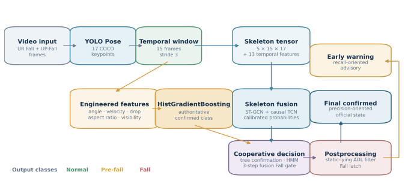
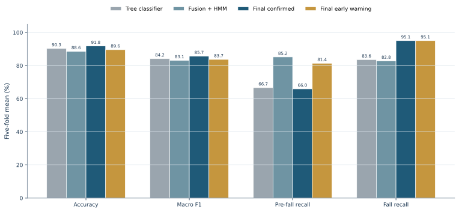
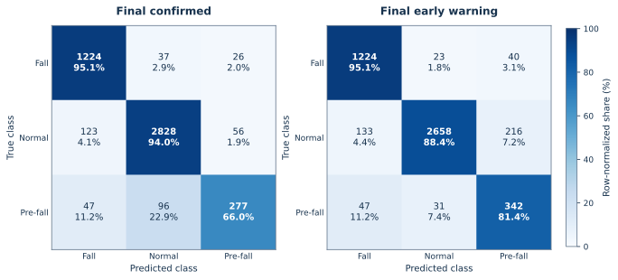
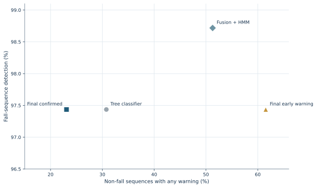

<div align="center">

# Pose-Based Fall Risk Prediction

**A cooperative tree and skeleton-feature fusion system for confirmed fall detection and early warning**


[Evolution](#development-timeline) · [Results](#results) · [Datasets](#datasets) · [Reproduction](#reproduction) · [Runtime inference](#runtime-inference) · [macOS app](#macos-app)

</div>

> [!IMPORTANT]
> This repository is a research prototype. It has not been clinically validated and must not be used as the sole component of a safety-critical monitoring system.

## Overview

The project predicts three states—**Normal**, **Pre-fall**, and **Fall**—from monocular video. YOLO Pose extracts 17 COCO keypoints, which are converted into 15-frame temporal windows with a stride of 3. Two complementary models then cooperate:

- **HistGradientBoosting** uses engineered motion and geometry features to provide the authoritative confirmed state.
- **ST-GCN + causal TCN fusion** combines skeleton dynamics with temporal features to improve early-warning sensitivity.
- **HMM smoothing, cooperative decision rules, and static-lying ADL filtering** stabilize the final outputs.

The runtime exposes two channels: a precision-oriented **final confirmed** state and a recall-oriented **early warning** advisory.



## Development Timeline

- **2026.06.15–2026.07.08 — Initial prototype:** Built the first three-state fall-risk pipeline using UR Fall and UP-Fall, combining YOLO Pose, temporal motion features, a tree-based classifier, HMM smoothing, and a Python-based macOS demo.

- **2026.07.23 — Major algorithm and architecture upgrade:** Evolved the original tree-model baseline into a cooperative dual-model system combining HistGradientBoosting with an ST-GCN + causal TCN deep-learning network, while adding robustness handling, leakage-aware grouped five-fold evaluation, and a native SwiftUI client backed by a local Python service.

- **2026.08.06 — Reproducible public release:** Finalized the macOS application and reproducibility workflow, improved the documentation and dataset guidance, removed obsolete artifacts, and merged the reviewed project into `main`.

## Results

The final evaluation uses grouped five-fold cross-validation. Camera views belonging to the same UP-Fall trial remain in the same outer fold to reduce view leakage. All values below are mean ± standard deviation across the five outer folds.

| Output | Accuracy | Macro F1 | Pre-fall precision | Pre-fall recall | Fall recall |
| --- | ---: | ---: | ---: | ---: | ---: |
| Tree classifier | 90.32 ± 1.77% | 84.19 ± 2.71% | 76.95 ± 1.55% | 66.67 ± 8.36% | 83.62 ± 6.16% |
| Fusion + HMM | 88.59 ± 2.65% | 83.12 ± 2.96% | 59.34 ± 3.14% | **85.23 ± 8.47%** | 82.82 ± 5.05% |
| **Final confirmed** | **91.83 ± 2.59%** | **85.71 ± 2.34%** | **77.19 ± 1.59%** | 65.96 ± 7.96% | **95.06 ± 3.37%** |
| **Early warning** | 89.60 ± 2.68% | 83.73 ± 2.21% | 57.42 ± 2.75% | 81.40 ± 8.54% | **95.06 ± 3.37%** |



The cooperative system improves confirmed Fall recall by 11.44 percentage points over the tree model while retaining the strongest overall accuracy and Macro F1. The early-warning channel recovers substantially more Pre-fall windows, with the expected reduction in Pre-fall precision.

### Confusion matrices

The matrices aggregate out-of-fold predictions across all 4,714 windows. Each cell shows the sample count and row-normalized percentage.



### Sequence-level behavior

Both deployed outputs detect Fall in **76 of 78 Fall sequences (97.44%)**. On 39 non-Fall sequences, the final confirmed channel produces any warning in 9 sequences and a false Fall in 5; the early-warning channel warns in 24 sequences and produces a false Fall in 6.



<sub>The sequence chart intentionally uses a restricted detection-rate axis so the differences remain visible; exact values are printed beside each point.</sub>

## Datasets

The experiments use the RGB camera streams from two public fall-detection datasets. Raw media is not redistributed by this repository.

| Dataset | Original content | Use in this project |
| --- | --- | --- |
| [UR Fall Detection Dataset](https://fenix.ur.edu.pl/~mkepski/ds/uf.html) | 30 Fall and 40 activity-of-daily-living (ADL) sequences captured with Kinect cameras and accelerometers | RGB image sequences only; YOLO Pose extracts 17 COCO keypoints |
| [UP-Fall Detection Dataset](https://doi.org/10.3390/s19091988) | 17 healthy young participants performing 6 ADLs and 5 simulated falls, with 3 trials per activity and multiple sensor modalities | The two camera views only; wearable, ambient, infrared, EEG, and other sensor channels are not used |

UR Fall is published for non-commercial academic use under the terms stated on its official dataset page. UP-Fall users should review the current terms provided by the dataset authors. Downloading either dataset is the user's responsibility, and use of the data does not imply clinical validity or permission for commercial deployment.

### Local data layout

Place the downloaded RGB videos or image-sequence directories under:

```text
data/videos/
├── urfall/
└── upfall/
```

The exporter discovers `.mp4`, `.avi`, `.mov`, and `.mkv` files as well as directories containing image sequences. Source stems must match the `video` column in `data/ur_up_train_drop60f_15pct_annotations.csv`. For example, UP-Fall inputs use identifiers such as `Subject1Activity1Trial1Camera1`, while UR Fall inputs use identifiers such as `fall-01-cam0-rgb` and `adl-01-cam0-rgb`.

UP-Fall camera views from the same subject, activity, and trial are assigned to the same outer fold. This pairing is required to prevent the second camera view of a trial from leaking into evaluation.

### Evaluation subset

The reported experiments combine the selected UR Fall and UP-Fall visual sequences into grouped temporal windows.

| Item | Value |
| --- | ---: |
| Labeled windows | 4,714 |
| Frames per window | 15 |
| Window stride | 3 frames |
| Camera sequences | 117 |
| Independent video/trial groups | 93 |
| Normal | 3,007 (63.79%) |
| Fall | 1,287 (27.30%) |
| Pre-fall | 420 (8.91%) |
| Evaluation | Grouped 5-fold cross-validation |
| Random seed | 42 |

The generated feature exports are also excluded from Git because of repository size. The tracked annotations, final model artifacts, and machine-readable evaluation results are sufficient to inspect the final protocol, but raw-media preprocessing requires the user-supplied datasets.

## Repository layout

| Path | Purpose |
| --- | --- |
| `fall_prediction/` | Pose processing, feature extraction, models, training, and runtime inference |
| `scripts/` | Cross-validation, tuning, evaluation, and final-result verification |
| `data/` | Versioned interval annotations |
| `models/` | Final tree, fusion, pose, and fold-specific model artifacts |
| `reports/` | Machine-readable training and evaluation results |
| `figures/` | Reproducible README figures and their generation source |
| `tests/` | Algorithm unit tests |
| `app/macos/` | Native SwiftUI application and local Python service |

## Requirements

The reference environment uses **Python 3.11**. The package supports Python 3.10–3.12, but exact-result verification should use the locked Python 3.11 environment.

Key recorded versions include NumPy 2.4.6, SciPy 1.17.1, scikit-learn 1.9.0, joblib 1.5.3, PyTorch 2.12.1, Matplotlib 3.11.0, OpenCV 4.13.0.92, and pytest 9.1.1. Inference runs on CPU by default; a GPU is not required for verification.

```bash
python3.11 -m venv .venv
source .venv/bin/activate
python -m pip install --upgrade pip
python -m pip install -r requirements-lock.txt
```

For a smaller editable development environment:

```bash
python -m pip install -e ".[yolo,deep,dev]"
```

## Reproduction

Reproducibility is split into three levels because raw videos and generated features are intentionally not versioned.

### 1. Verify the checkout

The tracked tests and final artifact hashes can be verified without the raw datasets:

```bash
python -m pytest -q
shasum -a 256 -c FINAL_ARTIFACTS.sha256
```

Expected result: **104 tests pass**, and every tracked final artifact reports `OK`.

### 2. Regenerate the final evaluation JSON

Byte-for-byte regeneration additionally requires the feature CSV files produced during preprocessing under `outputs/features/`. With those files available:

```bash
./scripts/reproduce_final_result.sh --with-tests
```

The script verifies all checksums, retrains the tree branch for each preserved outer fold, regenerates the out-of-fold predictions, and compares the new JSON report with `reports/dual_model_tuned_static_lying_postprocess_5fold_cv.json`.

### 3. Reproduce from raw videos

Place user-supplied UR Fall and UP-Fall media under `data/videos/`, then export features with the same pose model:

```bash
python -m fall_prediction.export_dataset_features \
  --input-dir data/videos/urfall \
  --output-dir outputs/features/urfall_yolo \
  --pose-backend yolo \
  --yolo-model models/yolo26n-pose.pt

python -m fall_prediction.export_dataset_features \
  --input-dir data/videos/upfall \
  --output-dir outputs/features/upfall_yolo \
  --pose-backend yolo \
  --yolo-model models/yolo26n-pose.pt
```

Use `data/ur_up_train_drop60f_15pct_annotations.csv` for the final interval labels. Dataset-specific file naming and camera pairing must match the annotation keys before the grouped evaluation can be regenerated.

<details>
<summary><strong>Full fusion cross-validation and tuning pipeline</strong></summary>

This procedure retrains temporary candidates and is substantially slower than verifying the preserved fold models.

```bash
python scripts/cross_validate_fusion.py \
  --input-dir outputs/features \
  --annotations data/ur_up_train_drop60f_15pct_annotations.csv \
  --output reports/fusion_grouped_5fold_cv.json

python scripts/retrain_cv_full_outer.py \
  --source-report reports/fusion_grouped_5fold_cv.json \
  --input-dir outputs/features \
  --annotations data/ur_up_train_drop60f_15pct_annotations.csv \
  --output reports/fusion_grouped_5fold_cv_full_outer.json

python scripts/tune_fusion_weight_calibration_cv.py \
  --source-report reports/fusion_grouped_5fold_cv_full_outer.json \
  --input-dir outputs/features \
  --annotations data/ur_up_train_drop60f_15pct_annotations.csv \
  --no-resume

./scripts/reproduce_final_result.sh
```

</details>

## Runtime inference

Run the cooperative model on a camera, video, or image-sequence directory:

```bash
python -m fall_prediction \
  --source 0 \
  --pose-backend yolo \
  --yolo-model models/yolo26n-pose.pt \
  --predictor ensemble \
  --classifier-model models/yolo_tail60_prefall_accel_robust_classifier.joblib \
  --fusion-model models/skeleton_feature_fusion_tuned.pt \
  --use-accel \
  --show
```

Replace `0` with a video path or image directory when a live camera is not required. Static-lying ADL correction is a runtime postprocessing rule and does not rewrite training labels.

## macOS app

`app/macos/` contains a local-first SwiftUI client backed by an authenticated Python service bound to `127.0.0.1`. It supports live camera monitoring, imported-media analysis, event history, local notifications, and packaged `.app` builds.

See the [macOS application guide](app/macos/README.md) for setup, architecture, tests, and packaging instructions.

## Limitations

- Results are grouped cross-validation estimates, not performance on a separate untouched external test set.
- Evaluation is limited to the supplied UR Fall and UP-Fall material; generalization to new rooms, cameras, activities, and populations is unverified.
- Sliding windows overlap, although grouping prevents the same video/trial group from crossing outer folds.
- Pre-fall boundaries are inherently uncertain and depend on the annotation protocol.
- Cooperative postprocessing was developed on the available project data and should be validated prospectively.
- End-to-end latency, resource usage, clinical utility, and real-world alert burden have not been benchmarked.

## Machine-readable evidence

- [Final grouped five-fold results (JSON)](reports/dual_model_tuned_static_lying_postprocess_5fold_cv.json)
- [Full outer-fold fusion report (JSON)](reports/fusion_grouped_5fold_cv_full_outer.json)
- [Figure generation source](figures/source/generate_readme_figures.py)

The README figures are regenerated directly from the final JSON report:

```bash
python figures/source/generate_readme_figures.py
```
